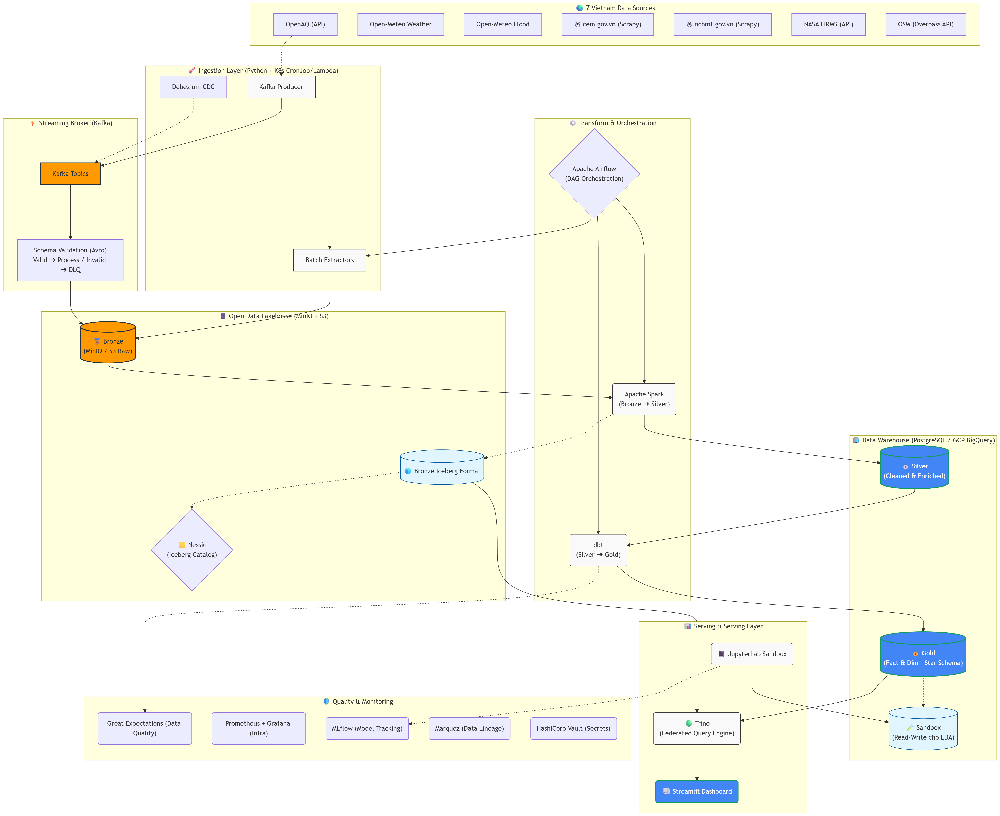

# Sơ đồ Kiến trúc UrbanPulse VN (Hybrid-Cloud & Medallion)

Kiến trúc bên dưới thể hiện luồng chạy dữ liệu từ lúc Ingestion (Batch/Streaming) qua các tầng Bronze, Silver, Gold và cuối cùng đưa lên hệ thống Serving và Dashboard theo kiến trúc Medallion kết hợp Open Data Lakehouse (Iceberg + Nessie + Trino).



```text
                         ┌──────────────────────────────────────┐
                         │         ORCHESTRATION (Airflow)       │
                         └──────────┬───────────────┬───────────┘
                                    │               │
 ┌──────────────┐  ┌────────────────▼──┐  ┌────────▼────────┐  ┌──────────────────┐
 │ DATA SOURCES │  │     BRONZE        │  │     SILVER       │  │      GOLD        │
 │  (7 VN src)  │  │   (Raw / Landing) │  │   (Cleaned)      │  │   (Business)     │
 │• OpenAQ      │  │                   │  │                  │  │                  │
 │• Open-Meteo  │─▶│  AWS S3 / MinIO   │─▶│  PostgreSQL /    │─▶│  PostgreSQL /    │
 │• 🕷CEM.gov   │  │  Parquet / JSON   │  │  BigQuery        │  │  BigQuery        │
 │• 🕷NCHMF.gov │  │  Apache Iceberg  │  │  dbt staging     │  │  dbt marts       │
 │• NASA FIRMS  │  │   (via Nessie)    │  │                  │  │                  │
 │• OSM         │  │                   │  │                  │  │                  │
 └──────┬───────┘  └───────────────────┘  └──────────────────┘  └────────┬─────────┘
        │                                                                │
 ┌──────▼───────┐  ┌──────────────────┐  ┌──────────────┐  ┌────────────▼─────────┐
 │  STREAMING   │  │ SCHEMA VALIDATION│  │  DATA QUALITY│  │     SERVING LAYER    │
 │  Kafka /     │─▶│ Valid → process  │  │• Great Expect│  │• Streamlit Dashboard │
 │  GCP Pub/Sub │  │ Invalid → DLQ    │  │• dbt tests   │  │• Grafana Monitoring  │
 └──────────────┘  └──────────────────┘  └──────────────┘  │• Trino / BigQuery   │
                                                           │• Looker Studio      │
 ┌─────────────────────────────────────────────────────────│• 🧪 Sandbox (Jupyter)│
 │  SANDBOX LAYER                                          └──────────────────────┘
 │  JupyterLab → Read Gold (SELECT only) → Write sandbox schema (read-write)    │
 │  EDA / ML experiments / cross-source correlation analysis                      │
 └────────────────────────────────────────────────────────────────────────────────┘
 ┌────────────────────────────────────────────────────────────────────────────────┐
 │                           INFRASTRUCTURE (Local / Hybrid)                     │
 │  DEV:   Docker Compose (Trino, Postgres, MinIO, Kafka, Redis, Nessie, Vault)  │
 │  K8S:   Kind cluster (Helm charts)                                            │
 │  CLOUD: Hybrid (AWS Lambda + S3) + (GCP BigQuery + Pub/Sub + Looker)          │
 └────────────────────────────────────────────────────────────────────────────────┘
```

## Giải thích Luồng Dữ liệu (Data Flow Diagram)

1. **Ingestion Layer:** 
   Các API và Crawler của Python sẽ thu thập dữ liệu về chất lượng không khí, thời tiết, thiên tai từ 7 nguồn tập trung vào Việt Nam. Dữ liệu batch được tải thẳng vào MinIO (Bronze Layer).

2. **Streaming & CDC:** 
   Các luồng stream API được bắn vào Kafka qua các schema đã định nghĩa (Schema Registry). Thông tin thay đổi từ PostgreSQL được bắt thông qua Debezium.

3. **Data Lakehouse (Nessie + Iceberg + MinIO):**
   Thay vì quản lý Data Lake thô, dữ liệu sau Ingestion được đẩy lên MinIO và chuyển sang định dạng Apache Iceberg được quản lý phiên bản bởi Project Nessie (cho hiệu suất đọc-ghi và time-travel tốt hơn).

4. **Transforming (Medallion Architecture):**
   * **Bronze ➔ Silver (Apache Spark):** Spark lấy nội dung gốc, làm sạch, xoá trùng lặp, chuẩn hoá kiểu dữ liệu rồi đẩy vào PostgreSQL (đóng vai trò như DWH nhỏ) / BigQuery sau này.
   * **Silver ➔ Gold (dbt):** dbt xây dựng các mô hình dữ liệu (Data Modeling) Star Schema gồm Fact và Dim tables trên Silver data để chuyển đổi thành Gold data phục vụ cho BI và Report.

5. **Data Quality & Sandbox:**
   * Dữ liệu xuyên suốt quá trình được Great Expectations validate. 
   * ML Engineers/Data Analysts có Schema `Sandbox` riêng biệt kết nối qua JupyterLab để gọi Model EDA hoặc query thử mô hình Gold, đồng thời track ML qua MLflow.

6. **Serving & Query Engine:**
   Sử dụng Trino làm federated query engine đứng ranh giới giữa Data Lake (MinIO) và Data Warehouse (Postgres) cho phép query liên thông (cross-query) mà không cần di chuyển dữ liệu, phục vụ Dashboard Streamlit hiển thị.

7. **Orchestration & Lineage:**
   Toàn bộ luồng được lập lịch bởi Apache Airflow, giám sát sự cố bởi Grafana và Lineage biểu diễn trực quan bởi OpenLineage (Marquez).
